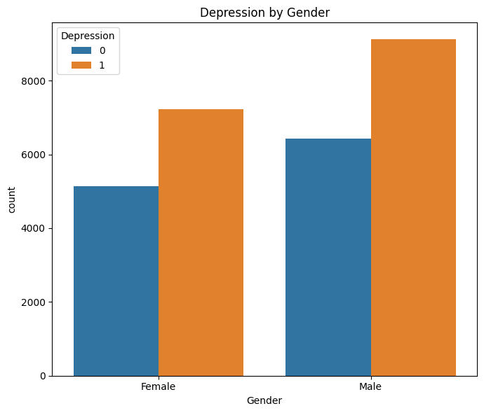

# StudentMind Insights

## Project Overview

This project analyzes mental health data among students, focusing on depression and suicidal thoughts across various demographic and lifestyle factors. The analysis provides insights into how different variables correlate with mental health outcomes in the student population.

## Dataset

The dataset contains information about:

* Demographics (Gender, Age, City)
* Academic information (CGPA, Degree, Study Satisfaction)
* Professional status (Profession)
* Lifestyle factors (Sleep Duration, Dietary Habits)
* Mental health indicators (Depression, Suicidal Thoughts)
* Family history of mental illness
* Various pressure factors (Academic Pressure, Work Pressure, Financial Stress)

## Key Findings

### Depression Statistics

* 58.5% of students in the dataset reported experiencing depression
* 63.3% of students reported having had suicidal thoughts
* Strong correlation between depression and suicidal thoughts (79% of those with suicidal thoughts also reported depression)

### Demographic Factors

* Depression rates vary by gender, age group, and profession
* Age shows a negative correlation with depression (-0.226), suggesting younger students may be more vulnerable
* Family history of mental illness shows a significant relationship with depression rates

### Academic Factors

* Academic pressure has the strongest positive correlation with depression (0.475)
* Study satisfaction shows a negative correlation with depression (-0.168)
* CGPA appears to have minimal correlation with depression (0.022)

### Lifestyle Factors

* Sleep duration shows important relationships with depression rates
* Work/study hours correlate positively with depression (0.209)

## Visualizations

The project includes various visualizations:

* Bar plots showing depression and suicidal thoughts by demographic factors
* Distribution plots for age and other continuous variables
* Cross-tabulations of mental health indicators with various factors
* Correlation heatmaps for numerical variables

## Analysis Focus

The analysis particularly examines:

1. Prevalence of depression and suicidal thoughts across different demographics
2. Relationship between academic/work factors and mental health
3. Impact of lifestyle choices on depression rates
4. Influence of family history on mental health outcomes

## Conclusion

This analysis provides valuable insights into the mental health challenges faced by students and identifies key factors that correlate with depression and suicidal thoughts. These findings could inform targeted interventions and support systems for vulnerable student populations.